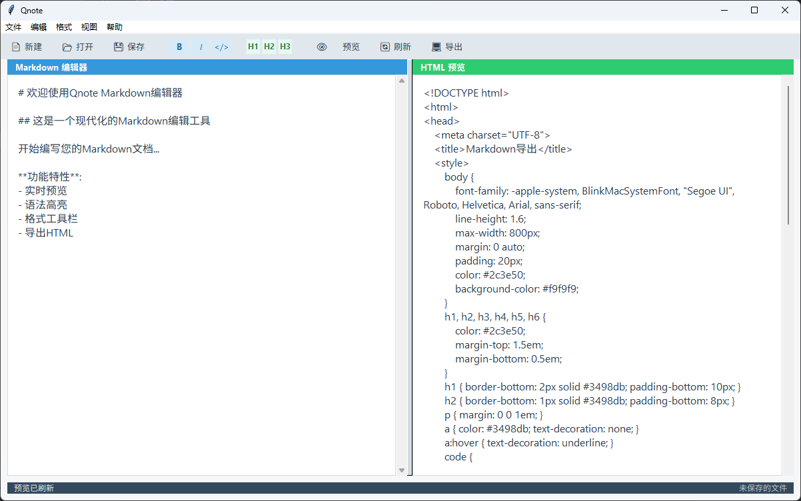

# Qnote Markdown Editor

Qnote 是一个现代化的 Markdown 编辑器，提供实时预览、语法高亮和丰富的格式工具，让您轻松编写和预览 Markdown 文档。

## 功能特点

- **实时预览**：在编辑区输入 Markdown，右侧即时显示 HTML 预览
- **格式工具栏**：快速插入标题、粗体、斜体、代码块等常用格式
- **HTML 导出**：将 Markdown 文档导出为美观的 HTML 文件
- **文件管理**：新建、打开、保存 Markdown 文件
- **浏览器预览**：在默认浏览器中预览渲染后的 HTML
- **语法帮助**：内置 Markdown 语法参考链接
- **查找功能**：快速定位文档内容
- **撤销/重做**：支持编辑历史操作
- **状态显示**：实时显示光标位置、行号等信息

## 截图预览



## 安装与使用

### 依赖安装
```bash
pip install markdown2
```

### 运行程序
```bash
python Qnotex.py
```

## 使用说明

### 基本操作
- **新建文件**：文件菜单 > 新建 或 Ctrl+N
- **打开文件**：文件菜单 > 打开 或 Ctrl+O
- **保存文件**：文件菜单 > 保存 或 Ctrl+S
- **导出 HTML**：文件菜单 > 导出HTML 或 工具栏导出按钮
- **预览 HTML**：视图菜单 > 预览Markdown 或 工具栏预览按钮

### 格式快捷键
- **标题**：工具栏 H1/H2/H3 按钮
- **粗体**：工具栏 B 按钮
- **斜体**：工具栏 I 按钮
- **代码块**：工具栏 </> 按钮
- **链接**：格式菜单 > 链接
- **图片**：格式菜单 > 图片
- **列表**：格式菜单 > 无序列表/有序列表

### 其他功能
- **查找文本**：编辑菜单 > 查找 或 Ctrl+F
- **Markdown 语法帮助**：帮助菜单 > Markdown语法
- **项目 GitHub**：帮助菜单 > Github

## 开发信息

### 技术栈
- Python 3.x
- Tkinter (GUI)
- markdown2 (Markdown 解析)

### 目录结构
```
Qnote/
├── main.py          # 主程序
├── README.md        # 项目文档
├── LICENSE          # MIT 许可证
└── icon.ico         # 应用程序图标（可选）
```

### 更新日志
[点击这里查看](update_log.md)

### 贡献
欢迎通过 GitHub 提交问题和贡献代码：
[https://github.com/Reoame/Qnotex](https://github.com/Reoame/Qnotex)

## 许可证

本项目采用 MIT 许可证 - 详细信息请查看 [LICENSE](LICENSE) 文件。

```
MIT License

Copyright (c) 2025 Reoame

Permission is hereby granted, free of charge, to any person obtaining a copy
of this software and associated documentation files (the "Software"), to deal
in the Software without restriction, including without limitation the rights
to use, copy, modify, merge, publish, distribute, sublicense, and/or sell
copies of the Software, and to permit persons to whom the Software is
furnished to do so, subject to the following conditions:

The above copyright notice and this permission notice shall be included in all
copies or substantial portions of the Software.

THE SOFTWARE IS PROVIDED "AS IS", WITHOUT WARRANTY OF ANY KIND, EXPRESS OR
IMPLIED, INCLUDING BUT NOT LIMITED TO THE WARRANTIES OF MERCHANTABILITY,
FITNESS FOR A PARTICULAR PURPOSE AND NONINFRINGEMENT. IN NO EVENT SHALL THE
AUTHORS OR COPYRIGHT HOLDERS BE LIABLE FOR ANY CLAIM, DAMAGES OR OTHER
LIABILITY, WHETHER IN AN ACTION OF CONTRACT, TORT OR OTHERWISE, ARISING FROM,
OUT OF OR IN CONNECTION WITH THE SOFTWARE OR THE USE OR OTHER DEALINGS IN THE
SOFTWARE.
```